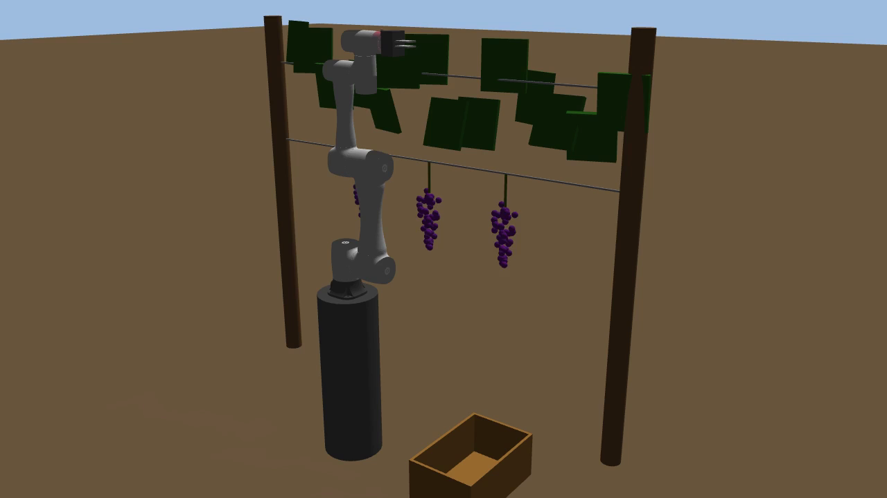
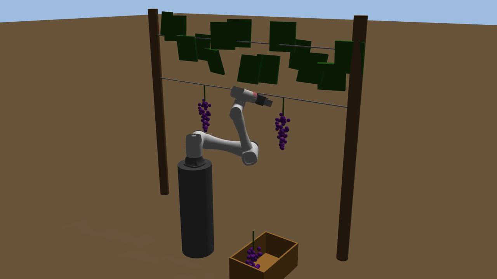
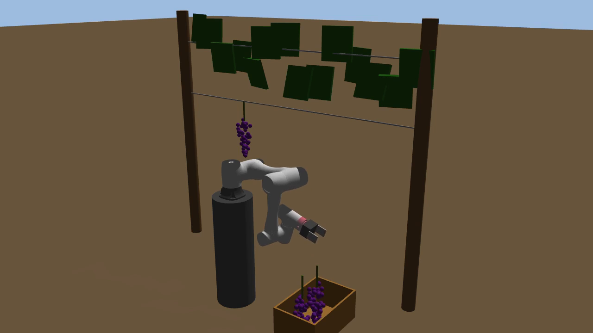
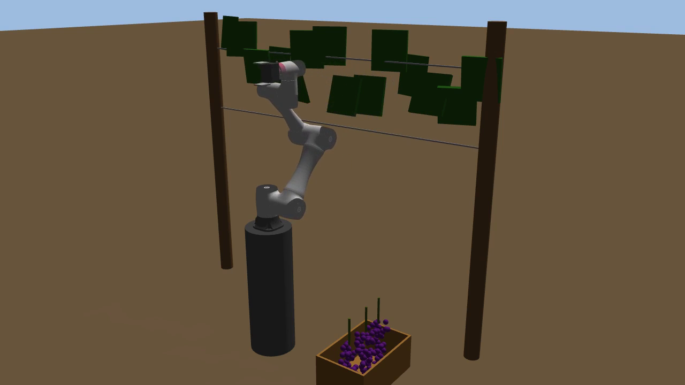

# grasp_grape — 葡萄采摘机器人 Gazebo 仿真

ROS Noetic + Gazebo 11 下的葡萄采摘作业仿真：用越疆 **Dobot CR5** 协作臂
夹住果梗、剪断、分格放入采收筐。仿真在 WSL2 的 `Ubuntu-20.04-ROS1` 里开发。

项目分两个阶段，**阶段一已完成并验证，阶段二正在进行中**（见下方「当前状态」）。

| | 阶段一（已完成） | 阶段二（进行中） |
|---|---|---|
| 场景 | 单个篱架，3 串葡萄 | 4 排 × 每排 4 板，果串随机分布 |
| 底座 | 固定立柱 | 四轮滑移转向移动平台，颠簸土路 |
| 定位 | 世界系固定 | ground truth 发 `world→odom`（VINS-Mono 占位） |

## 演示（阶段一：3/3 全部剪下入筐）






完整录像：[`media/cr5_grape_harvest.mp4`](media/cr5_grape_harvest.mp4)
（117 秒，实测 19.44 fps 录制）

最后一次运行结果：三串全部剪下，等高并排躺在筐底（z 都是 0.422，没有叠罗汉），
碰撞自检确认立柱、铁丝、采收筐、地面均未被碰动。

## 目录结构

```
src/grape_harvest/
  urdf/cr5_grape.xacro      机器人：移动平台 + CR5 + 剪切式末端执行器
  worlds/vineyard.world     园区世界（由 make_models.py 生成）
  models/                   trellis 篱架、dirt_track 土路（生成物）
  config/                   SRDF、MoveIt、Gazebo 控制器、关节限位
  launch/                   grape_pick_demo / vineyard_gazebo / moveit
  scripts/
    make_models.py          场景生成：所有布局常量的唯一来源
    pick_grape.py           采摘循环（阶段二尚未移植，见下）
    drive.py                行间车道保持
    world_tf.py             world→odom 修正，VINS-Mono 的占位节点
    stow_check.py           实测收拢构型的臂展包络
    diag.py / diag2.py      工具系朝向、碰撞接触点自检
```

## 依赖与搭建

需要 ROS Noetic + Gazebo 11。两个第三方包不 vendor 在本仓库里，请自行 clone 到 `src/`：

```bash
mkdir -p ~/grape_ws/src && cd ~/grape_ws
git clone https://github.com/terrense/grasp_grape.git .

cd src
# 越疆官方 CR5 包，提供 URDF + meshes
git clone https://github.com/Dobot-Arm/TCP-IP-ROS-6AXis.git
# 用来实现"剪断"：运行时建立/解除固连关节
git clone https://github.com/pal-robotics/gazebo_ros_link_attacher.git

cd ~/grape_ws && catkin build   # 或 catkin_make
```

## 运行

```bash
# run_sim.sh 已把 source 和 GAZEBO_MODEL_PATH 都包好
~/grape_ws/run_sim.sh roslaunch grape_harvest grape_pick_demo.launch

# 带 MoveIt RViz 界面
~/grape_ws/run_sim.sh roslaunch grape_harvest grape_pick_demo.launch rviz:=true

# 行间通过性测试：收臂后开过 1.6 m 的行距
~/grape_ws/run_sim.sh rosrun grape_harvest drive.py _aisle:=0 _stow_first:=true

# 录像（务必配 gui:=false，否则 GUI 渲染抢 CPU 导致相机丢帧）
~/grape_ws/run_sim.sh roslaunch grape_harvest grape_pick_demo.launch \
    gui:=false record:=true video:=$HOME/cr5_grape_harvest.mp4
```

场景要改布局，只改 `scripts/make_models.py` 顶部的常量，然后重新生成：

```bash
python3 src/grape_harvest/scripts/make_models.py
```

`pick_grape.py` 直接 import 这些常量，所以场景和运动规划不会各改各的。

## 当前状态

阶段二的**场景和机器人已经完成**：4 排园区、随机果串分布、四轮滑移转向平台、
floating 底座关节、`drive.py` / `world_tf.py` / `stow_check.py` 三个新节点都已就位。

**已知问题：`scripts/pick_grape.py` 还是阶段一的版本，当前跑不起来。**
它从 `make_models` import 的 `VINE_X` / `BUNCH_Y` / `CRATE_XY` / `GRASP_Z` 等 9 个名字
在重写后的 `make_models.py` 里已不存在，会直接 ImportError；
`grape_pick_demo.launch` 的 `auto_start` 因此默认为 `false`。

移植要做的事：单串坐标改为 `bunch_layout()` 返回的整块果串列表；
采收筐从世界固定点改为 base_link 系的 `CRATE_BASE_XYZ` + `CRATE_SLOTS`（筐随车走，须走 TF 解算）；
再串成「开到某板 → 展臂 → 采完该板 → 收拢 → 开下一板」的整块作业循环。

阶段二的 `drive.py` 行间通过性测试尚未跑过。

## 设计说明

机型选择、为什么重写厂商 URDF、"剪断"如何实现、录像帧率为什么要实测、
以及调试过程中踩过的十几个坑（IK 接近轴反向、轨迹容差、RRTConnect 超时……），
都记在 [`src/grape_harvest/README.md`](src/grape_harvest/README.md)。

## 已知限制

- `gazebo_ros_control` 没配 PID 增益，走 `Joint::SetPosition` 直接定位，关节相当于无限刚性，
  **不能用来评估力控、碰撞载荷或跟踪精度**。
- 冠层叶片只有 visual 没有 collision，相当于假设采收前已完成疏叶。
