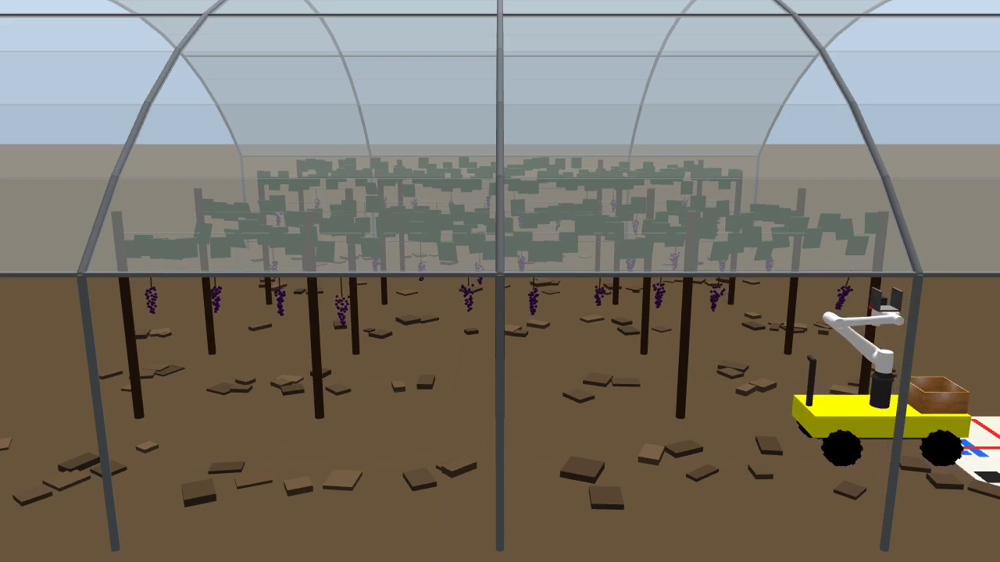
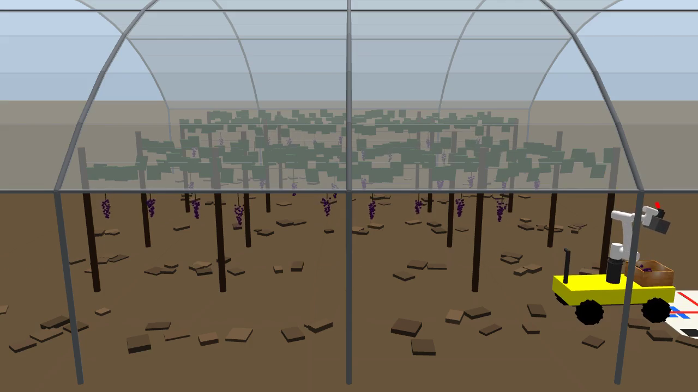
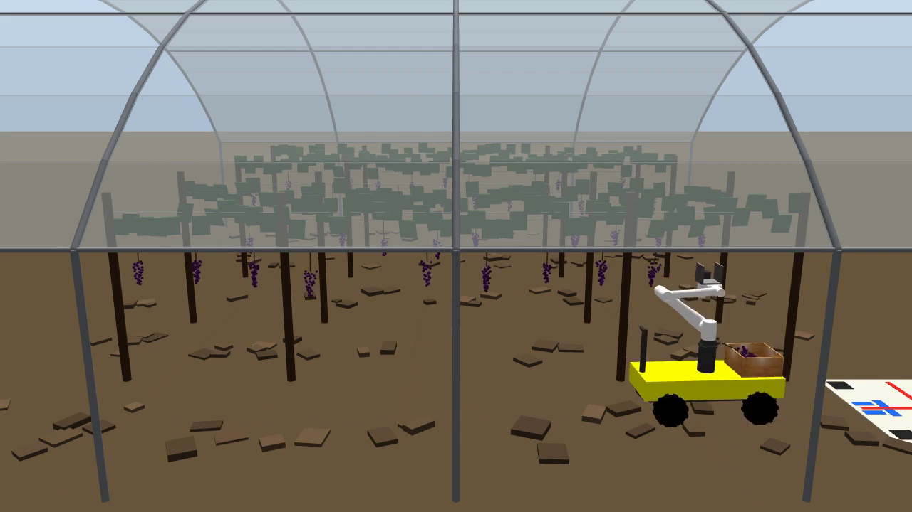
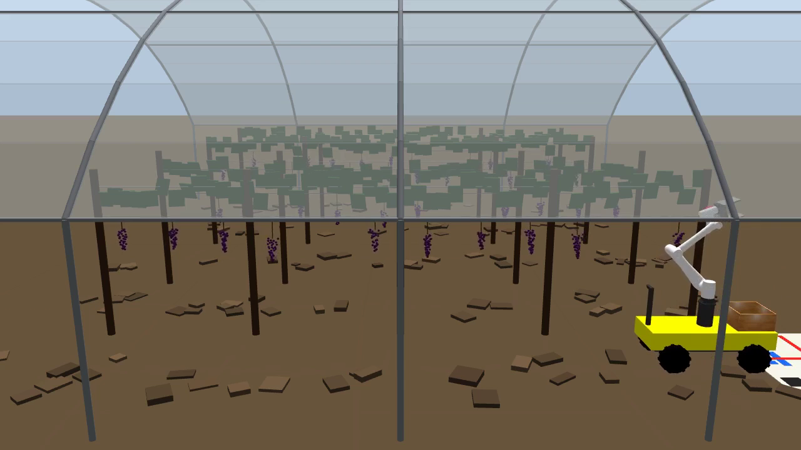
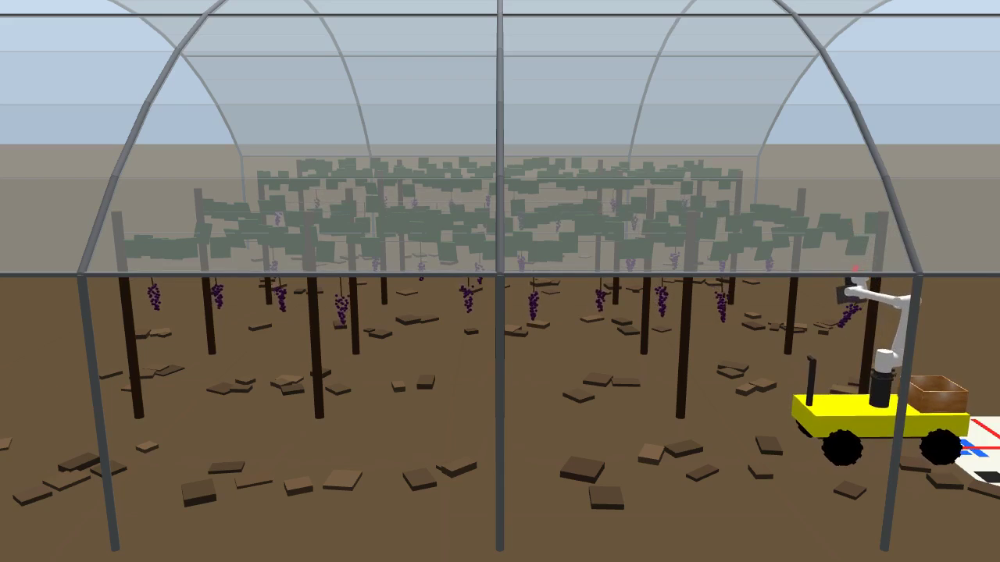

<div align="center">

# grasp_grape

**设施葡萄园激光采收机器人 · Gazebo 全流程仿真**

Laser-cutting grape harvesting robot in a polytunnel vineyard — a full ROS 1 simulation

[](http://wiki.ros.org/noetic)
[](https://classic.gazebosim.org/)
[](https://moveit.ros.org/)
[](https://www.dobot-robots.com/)
[](#系统构成)
[](https://github.com/HKUST-Aerial-Robotics/VINS-Mono)

</div>

<p align="center">
  
</p>

---

## 这是什么

一台在**塑料大棚**里作业的葡萄采收机器人的完整仿真：四轮滑移转向平台驮着一台
**Dobot CR10**，沿垄行驶，用**激光**切断果梗，把葡萄收进随车的采收筐。

不是一个摆姿势的演示。场景里的每一样东西都按真实约束建模，也都被实测验证过：

- **垄距不等**（2.2–3.0 m 随机），所以"行间中线"不是一个可用的站位基准
- **果串挂在 1.4–1.7 m**，每垄的结果铁丝高度和每串的果梗长度都独立随机
- **激光是 Gazebo 射线传感器**，会被真正挡在中间的东西遮挡，会报距离——不是几何断言
- **底盘会翻车**，所以它有 802 kg 的质量和压到 0.25 m 的重心
- **单目 VIO 在匀速爬行的地面车上初始化不了**，所以出发前有一段激励动作

## 演示

<p align="center">
  <a href="media/laser_harvest.mp4"><b>▶ 完整视频（3 分钟，真实速度）</b></a>
</p>

<p align="center">
<sub>一垄连续采收 6 串 · 零驱动超时 · 6/6 全部留在筐里 · 立柱铁丝地面均未碰动</sub>
</p>

| | |
|:--:|:--:|
|  |  |
| 大棚下的四垄园区，39 串果实 | 平台贴垄停稳，机械臂展开对位 |
|  |  |
| 切断后搬运回车载采收筐 | 收拢、移位、采第二串 |

---

## 系统构成

| 部件 | 选型 / 参数 | 为什么 |
|---|---|---|
| **移动平台** | 四轮滑移转向，1.50 × 0.56 m，802 kg，重心 0.25 m | 滑移转向没有转向连杆可以挂在垄沟上；质量压低是为了不被立柱掀翻 |
| **车轮** | 320 × 120 mm 花纹越野胎，轴距 0.96 m，轮距 0.64 m | 土路有干土块和车辙 |
| **机械臂** | Dobot CR10，臂展 1.3 m，装在 0.75 m 立柱上 | CR5 的 0.9 m 够不到 1.7 m 高的果串（见下） |
| **末端** | 激光切割头 + 开底导向围栏 + eye-in-hand RealSense | 激光切不住东西，围栏负责导向；相机留给后续果实识别 |
| **激光** | Gazebo `ray` 传感器，工作距离 184 mm，有效射程 0.35 m，照射 1.5 s 切断 | 射线会被遮挡、会报距离，能分清"对准了"和"立柱挡在前面" |
| **定位** | 车体前视 RGB-D + 200 Hz IMU → VINS-Mono | 前桑相机随车体刚性连接，外参才成立 |
| **场景** | 4 垄 × 4 板，39 串，垄距 2.2–3.0 m 不等，单体大跨拱棚 12.7 m 跨 / 脊高 5 m | 全部由 `make_models.py` 单一来源生成 |

### 一个把整套设计逼出来的数字

果串在 **1.4–1.7 m**，垄距 **2.2–3.0 m**。站在行间中线时到果串的直线距离是
**1.28–1.78 m**，而 CR5 的包络只有 0.95 m——**够不到**。

两个改动一起才解决：换 **CR10**（1.3 m 臂展），并且**贴着垄走**而不是走中线
（`lane_x()`，固定站距 0.80 m）。最远的果串因此回到 1.234 m，落在包络内。
垄距不等也正是"中线不能当基准"的原因：它到藤的距离在 1.1–1.5 m 之间浮动。

---

## 快速开始

```bash
# 依赖：ROS Noetic + Gazebo 11
mkdir -p ~/grape_ws/src && cd ~/grape_ws
git clone https://github.com/terrense/grasp_grape.git .

cd src
git clone https://github.com/Dobot-Arm/TCP-IP-ROS-6AXis.git        # CR10 URDF + meshes
git clone https://github.com/pal-robotics/gazebo_ros_link_attacher.git

cd ~/grape_ws && catkin build && source devel/setup.bash
```

### 一条命令起演示（Gazebo + RViz + 遥控 + 自动臂）

```bash
~/grape_ws/run_sim.sh roslaunch grape_harvest teleop_demo.launch
```

会弹出三个窗口：Gazebo、RViz、和一个叫 `platform_throttle` 的终端。

| 键 | 作用 |
|:--:|---|
| `w` / `↑` | 沿垄前进 |
| `s` / `↓` | 后退 |
| `空格` | 停 |
| `+` / `-` | 调速（0.05–0.60 m/s） |
| `q` | 退出 |

**底盘归你开，机械臂自己干活**：车一动它就收臂，停稳一秒后扫一遍够得着的果串，
有就去切。刻意只做前后不做转向——臂的全部余量都花在 0.80 m 的贴垄站距上，
手动转向跑偏只会把果串推出可达范围。

### 其它入口

```bash
# 自动跑完一整垄
~/grape_ws/run_sim.sh rosrun grape_harvest pick_grape.py --row 0 --verify

# 只报 IK 可达性，不动
~/grape_ws/run_sim.sh rosrun grape_harvest pick_grape.py --check-only --no-drive

# 行间通过性 + VIO 激励
~/grape_ws/run_sim.sh rosrun grape_harvest drive.py _row:=0 _stow_first:=true _excite:=true

# VINS-Mono（容器里跑，只挂配置）
rosrun grape_harvest make_vins_config.py src/grape_harvest/config/vineyard_vins.yaml
sh src/grape_harvest/scripts/run_vins.sh

# 关节走力矩控制（PID 在控制器里）而不是把角度写进物理引擎
~/grape_ws/run_sim.sh roslaunch grape_harvest teleop_demo.launch torque:=true

# 改场景：所有布局常量都在 make_models.py 顶部
python3 src/grape_harvest/scripts/make_models.py
```

---

## 工作原理

```
                    ┌──────────────────────────────────────────┐
   人               │  teleop_base.py    键盘油门（只前后）      │
   │                └───────────────┬──────────────────────────┘
   │                                │ /cmd_vel
   ▼                ┌───────────────▼──────────────────────────┐
 平台               │  skid_steer_drive  ←→  ground_truth/state │
                    └───────────────┬──────────────────────────┘
                                    │ world→odom (world_tf.py，VINS-Mono 占位)
                    ┌───────────────▼──────────────────────────┐
   臂（自动）        │  pick_grape.py --teleop                   │
                    │   车停稳 → 扫可达果串 → 对位 → 照射切断     │
                    │   → 接住 → 搬运 → 入筐 → 收拢              │
                    └───────┬───────────────────┬──────────────┘
                            │ MoveIt/OMPL       │ /cut_laser/scan
                    ┌───────▼───────┐   ┌───────▼──────────────┐
                    │  arm_controller│   │  Gazebo ray sensor   │
                    └───────────────┘   └──────────────────────┘
```

**切断怎么建模。** 分两半：几何上，激光头上的射线传感器报出光束真正打在什么东西上、
多远——只有光束在有效射程内**持续照射 1.5 秒**才算切断，中途脱靶就中止；力学上，
果串本来用运行时固连关节挂在结果铁丝上，切断时**先**把它固连到末端、**再**解除铁丝
那一端，所以果实不会自由落体。

**为什么激光要有工作距离。** 发射口在头部上方，斜向下前方瞄准 TCP，工作距离 184 mm。
如果沿接近轴贴着果梗直射，末端几厘米的定位误差全落在光束方向上——而那正是激光最不该
敏感的方向，却因此把光束原点推到果梗后面去。

**无碰撞怎么保证。** MoveIt 的规划场景里放了 20 根立柱、4 条冠层铁丝、地面和全部 39 串
果实；车体和采收筐是机器人 link，由 URDF 提供。大棚故意不放进去——它是单体大跨，
落地腿只在两侧最外缘，离最近的工作车道 1.8 m，而臂只有 1.3 m，够不着。
`--verify` 会在跑前记录所有非目标物体的位姿，跑完逐一比对。

---

## 当前状态

| 能力 | 状态 | 实测 |
|---|:--:|---|
| 场景生成（垄距/果高/大棚随机可复现） | ✅ | 垄距 2.23/2.72/2.55 m，果高 1.433–1.690 m |
| 底盘遥控行驶 | ✅ | 车道误差 1 mm；故意撞击最大 roll 8.4°，不翻车 |
| 机械臂对位 | ✅ | 末端离指令位姿 **22 mm** |
| 激光切断 | ✅ | 光束在 0.057 m 命中果梗，照射 1.5 s 切断 |
| 搬运入筐 | ✅ | `IN CRATE`，碰撞自检：立柱/铁丝/地面均未碰动 |
| 连续采摘 | ✅ | **一垄连采 6 串，零驱动超时，6/6 全部留在筐里** |
| 整垄不间断作业 | ✅ | 停在 6 串是因为采收筐只有 6 格，不是失败 |
| 关节力矩控制 | ✅ | `torque:=true` 切换；**全程跟踪误差 0.003 rad**，稳态收敛到 1e-4（原为 0.53 rad 峰值 + 手腕 0.10 rad 卡死残差） |
| 腕部力/力矩感知 | ✅ | `/ee_ft`；重力补偿后自由运动噪声底 **4.5 N**（补偿前 25.4 N） |
| 反应式避障 + 末端顺从 | 🟡 | `guard:=true` 能停下真实碰撞并顺从果串；力矩控制下整周期还没跑满一垄 |
| VINS-Mono 接入 | 🟡 | 能初始化（需激励动作），但随后发散 |
| 果实视觉识别 | ⬜ | eye-in-hand 相机已就位，算法未做 |

---

## 理论笔记

[`docs/`](docs/) 是这个项目的技术笔记，每篇都是「通用理论 + 它在这套代码里的落点」，
带实测数字和踩过的坑。

| | 内容 | 一句话 |
|---|---|---|
| [01](docs/01-joint-control.md) | 关节控制与 PID | `SetPosition` 让机器人看起来完美——跟踪误差恒为零、关节无限刚性——而力控和接触载荷在那个模型里根本不存在 |
| [02](docs/02-motion-planning.md) | 运动规划 | `compute_cartesian_path` 返回的是**路径不是轨迹**，直接执行会报成功而机械臂纹丝不动 |
| [03](docs/03-collision-avoidance.md) | 碰撞检测与避障 | 避障不只是算一条不碰的路，还包括"万一碰了会发生什么" |
| [04](docs/04-mobile-base-control.md) | 移动底盘的控制 | 纯比例接近律会让转向分量把内侧轮抵消到零，车在原地打转走不完最后几厘米 |

---

## 工程日志

这个项目大部分时间不是在写新功能，是在把量出来的偏差追到根上。几条值得留档的：

<details>
<summary><b>手腕残差调了两轮增益都没用</b>（0.10 rad，最后是三个别的原因）</summary>

手腕两个关节稳定偏 0.07–0.10 rad。把增益调到 2.7 倍和 5 倍，**误差反而涨到 0.30 rad**。
"5 倍增益几乎不改变系统性偏差"这件事本身就说明它不是增益问题。三个真正的原因：

**一、积分饱和。** 停在 stow 上同时读误差和实际力矩：

| 关节 | 误差 (rad) | 实际力矩 | `Kp·e` | `i_clamp` | `Kp·e + i_clamp` |
|---|---|---|---|---|---|
| joint3 | −0.066 | −31.1 | −330 | 300 | **−30** |
| joint4 | −0.058 | +4.4 | −145 | 150 | **+5** |
| joint6 | −0.090 | −0.9 | −81 | 80 | **−1** |

三行都吻合到 1 N·m 以内。再静置 30 秒：joint3 自己退回 0，**joint4 和 joint6 四位
小数纹丝不动**。`control_toolbox` 在 `antiwindup` 关闭时只夹积分项的**输出**，
累加器继续无限增长，冲过头就退不回来。**`i_clamp` 不是抗饱和。**

**二、URDF 里没有电机转子的折算惯量。**

```
t(s)  | j4 误差  期望速度  实际速度   力矩  | j6 误差  实际速度    力矩
 0.98 | -0.014   -0.353    -0.298     3.6  | -0.025    -0.298    -3.3
 1.12 |  0.020   -0.353   +11.948   500.0  | -0.060   -44.465  -500.0
```

t=1.12 s 突然发散，两个关节的力矩同时钉死在 ±500 N·m。**方向相反是线索**：
joint4 和 joint6 是手腕的两个滚转轴，joint5 过零时两轴共线，差动模态失去惯量。

真机不会这样是因为减速器——转子惯量按减速比平方折算到输出端，100:1 配一个
5e-5 kg·m² 的转子就是 **0.5 kg·m²**。而 CAD 导出的 URDF 只有连杆：Link6 的惯量是
**1.1e-4 kg·m²**，差三个数量级。补上折算惯量、把阻尼改成隐式之后：

> **全程跟踪误差 0.53 rad → 0.003 rad**，实际速度与期望速度小数点后三位一致。

**三、容差是从台架动作取样的。** 台架单条轨迹跟到 0.003 rad，据此收紧容差，
整垄一跑立刻爆。按整周期实测重设（`path 0.35 / goal 0.05`）并把积分增益翻倍
（有了 antiwindup 才安全），控制器中止 **22 → 3** 次。

</details>

<details>
<summary><b>力监护报的每一次"碰撞"都是末端自己的重量</b></summary>

阈值定在 25 N，理由是"末端自重 17.4 N，超过就一定是接触"。结果每次运动都误触发，
还报出 108 N、1160 N、6211 N——1.8 kg 的末端不可能产生的数字。

于是做了早该做的事：在**完全没有接触**的情况下跑一段运动，测腕力分布。

| 自由运动（全程无接触） | 中位数 | p99 | **最大** |
|---|---|---|---|
| 原始读数 | 17.4 N | 18.0 | 19.6 |
| 减静态偏置（原来用的） | 11.2 N | 24.8 | **25.4** |
| 减重力模型 | 0.1 N | 0.9 | **4.5** |

阈值 25 N，自由运动峰值 25.4 N。传感器测的是法兰之后所有东西的受力，那 17.4 N 的
重力矢量**在传感器坐标系里随手腕姿态旋转**，一个运动前采样的固定偏置根本跟不上。
查 TF 求出当前姿态的重力分量再减，噪声底降到 4.5 N，阈值才敢定在 12 N。

> **先测噪声底，再定阈值。顺序不能反。**

</details>

<details>
<summary><b>换成力矩控制之后，一批"新" bug 冒出来——它们一直都在</b></summary>

接上力监护跑采摘，力矩控制下**下降抓取段几乎每次都顶到果串**，joint3 路径误差
0.35 rad，控制器直接判超差，手臂停在半路，之后每次规划都因起始状态碰撞而失败。

这个碰撞从第一版起就存在。位置控制下关节是被运动学驱动的，**手臂直接硬推过去**，
所以从来没有任何迹象——跟踪误差恒为零，日志一片干净。

而"停下"对下降段也是错的：料兜本来就是要合到果串上去的，**接触是这个动作的目标**。
现在按阶段区分：下降 / 顺从 / 伺服段的接触判为"到位，从这里开火"，其他阶段的接触
仍然中止并放弃该串。

> 从位置控制切到力矩控制，不是"控制方式变了"，而是**一批原本被掩盖的物理问题
> 会同时浮现**。它们不是新引入的 bug，是一直存在、只是无法观测的 bug。

</details>

<details>
<summary><b>轨迹报成功，机械臂却没动</b>（末端误差 0.54 m）</summary>

`compute_cartesian_path` 返回的是**路径不是轨迹**——路点不带时间戳。直接交给
`execute()` 会被接受、立刻返回成功，而机械臂纹丝不动。每一次"cartesian coverage
100%"后面跟着"末端差半米"都是这个。执行前加 `retime_trajectory`，误差 **0.54 m → 0.061 m**。

排查顺序值得记：先怀疑 `world_tf.py` 的 `world→odom`，实测 TF 与真值差 **0.0000 m**，
排除；再写最小复现（只用 MoveGroup 走命名位姿和显式位姿），显式位姿到位 **2.9 mm**，
一切正常——故障只可能在 `compute_cartesian_path` 这条路径上。

中途试过收紧控制器容差，当时"越收越糟"，因为轨迹压根没执行、容差自然无关。
**没定位根因之前不要调参数。**
</details>

<details>
<summary><b>果串碰撞盒挂反了方向</b>（阶段一遗留，随机化之后才暴露）</summary>

`tool_quat = Rz(az)·Ry(90°+PITCH)`，其 X 列在世界系 z 分量是 −0.94，即 **tool +X 朝下**，
而代码把切下的果串挂在 −X（朝上）。阶段一所有果梗等长、抓取高度固定，盒子顶端刚好差一点
没碰到冠层铁丝，所以一直没暴露；果高随机化到 1.16 m 之后退刀就顶进去，
而错误只报成一句 `ABORTED: TIMED_OUT`。
</details>

<details>
<summary><b>车道保持器有个偏置平衡点</b>（横偏 0.92 m 骑到藤上）</summary>

角速度原来是 `-K_CROSS·cross + K_YAW·yaw_err` 两项相加，这有个稳定的偏置解：
横向偏 0.256 m、航向偏 11° 时两项正好抵消，车就那么斜着一路开下去，最后骑到葡萄行上。
改成纯追踪式——横向误差先折算成一个瞄准航向，再单独把航向误差调零，偏置解就不存在了。
</details>

<details>
<summary><b>录像比真实动作快 2.6 倍</b></summary>

录像节点在开头 5 秒探测相机帧率，而那时 39 串果实还没生成、场景是空的。
spawn 之后 1300 多个浆果球体让渲染变重，相机掉到探测值的四分之一。
现在收尾时会用整段录制的真实帧率复核，偏差超过 5% 自动重编码。
</details>

<details>
<summary><b>单目 VIO 在地面车上初始化不了</b></summary>

VINS-Mono 要靠加速度方差观测重力和尺度，而平台匀速爬行几乎没有激励——实测开了 7.6 m
仍然一直报 `IMU excitation not enouth`。加了一段前后加速脉冲后立刻 `Initialization finish!`。
这不是仿真取巧，跑单目 VIO 的地面机器人在实际部署里就是要先晃这一下。

另外：镜像里其实**本来就编译好了**，是 `docker-compose.yml` 把宿主机上空的 `build/`
和 `devel/` 挂上去盖住了产物，所以 `source devel/setup.bash` 永远失败。
</details>

<details>
<summary><b>撞到立柱就翻车</b></summary>

整车才 132 kg，其中 33 kg 是臂和立柱挂在 0.6–1.5 m 高处，重心 0.51 m 对半轮距 0.32 m，
**静态翻覆角只有 32°**。解法不是单纯加重，是**把重量压低**：底盘 650 kg 且重心设在
底盘中心下方 0.14 m（电池组装在车架底部）。另一半原因是 Gazebo 默认接触刚度极大，
撞固定立柱是刚性冲击、能量一步全弹回车上；给车身加显式 `kp/kd` 之后同样的撞击变成推挤。
现在 802 kg、重心 0.250 m、翻覆角 **52°**。
</details>

---

## 路线图

- [ ] 采收筐扩容与卸筐，让一次作业不止 6 串
- [ ] VINS-Mono 发散：IMU 噪声模型、地面车平面运动退化、场景重复性、容器 `use_sim_time`
- [ ] eye-in-hand 相机接果实检测，用视觉定位替代先验坐标
- [ ] 换垄与整块调度
- [ ] 重做下降抓取的接近几何，让力矩控制下整垄作业不被真实接触打断
- [x] ~~补 PID 增益让力控和跟踪精度成为可评估量~~ —— 已完成，但真正的障碍不是增益：
      见工程日志「手腕残差调了两轮增益都没用」

## 已知限制

- 主线仍走 `Joint::SetPosition`（无限刚性，跟踪误差恒为零），因为它跑完整垄最稳。
  要评估力控、碰撞载荷或跟踪精度，用 `torque:=true`——那条路径现在跟踪误差
  0.003 rad，是可信的
- 力矩控制下暴露出**下降抓取段会顶到果串**（joint3 路径误差 0.35 rad）。这个碰撞
  一直存在，只是位置控制把它推过去了；采摘循环的接近几何还没为接触重新设计
- 冠层叶片只有 visual 没有 collision，相当于假设采收前已完成疏叶
- 采收筐 6 格，一次作业最多 6 串，装满即停，未建模卸筐

---

## 团队

<table>
<tr>
<td align="center" width="50%">
<a href="https://github.com/terrense">
<br>
<b>沈鑫 · terrense</b>
</a><br>
<sub><b>系统设计 · SLAM · 底盘选型</b></sub><br>
<sub>整体架构与技术路线 · 视觉惯性里程计接入<br>
移动平台选型与场景建模 · 作业流程设计</sub>
</td>
<td align="center" width="50%">
<a href="https://github.com/NaYangyeee">
<br>
<b>娜样 · NaYangyeee</b>
</a><br>
<sub><b>运动控制 · 机器人仿真</b></sub><br>
<sub>机械臂运动规划与轨迹执行 · 末端执行器建模<br>
Gazebo 物理参数整定 · 控制器调试</sub>
</td>
</tr>
</table>

## 致谢

- [Dobot-Arm/TCP-IP-ROS-6AXis](https://github.com/Dobot-Arm/TCP-IP-ROS-6AXis) — CR10 URDF 与 meshes
- [pal-robotics/gazebo_ros_link_attacher](https://github.com/pal-robotics/gazebo_ros_link_attacher) — 运行时固连关节
- [HKUST-Aerial-Robotics/VINS-Mono](https://github.com/HKUST-Aerial-Robotics/VINS-Mono) — 视觉惯性里程计

<div align="center">
<sub>阶段一（固定立柱 + 剪切式末端）的记录保留在 <a href="media/archive/phase1_cr5_fixed_pedestal.mp4">media/archive</a>。</sub>
</div>
